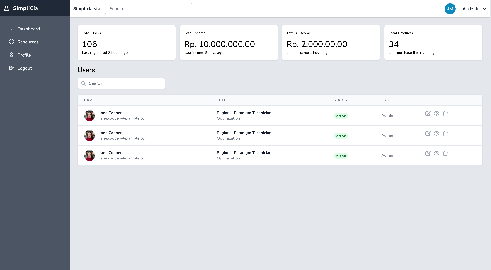

# Simplicia



## About
Simple admin dashboard using tailwindcss inspired by Laravel Nova UI

## Installation
Install depedencies:
```
npm install
```

Start development server
```
npm run dev
```

Build assets
```
npm run build
```

Compiled css file can be found at `dist` folder.

## Depedencies
1. Tailwindcss
2. Live-server

## License
The Project is open-sourced software licensed under the [MIT license](https://opensource.org/licenses/MIT).
